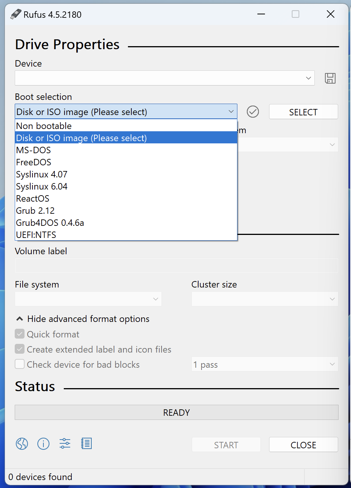
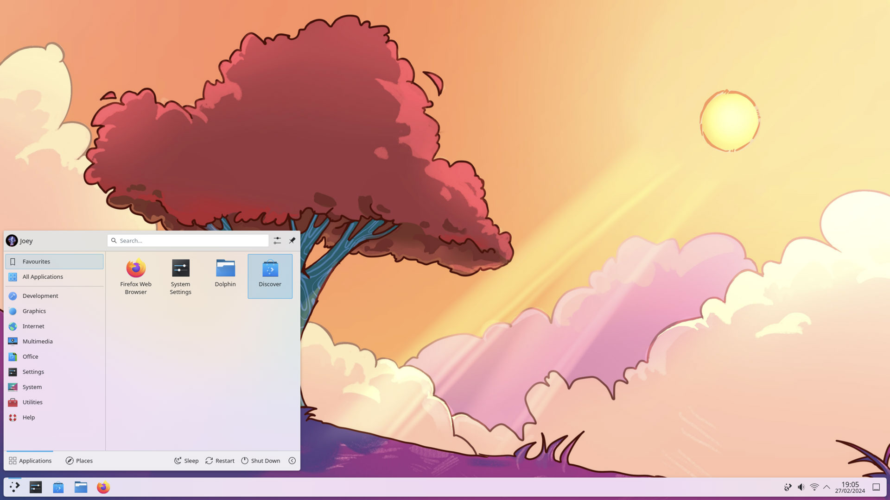
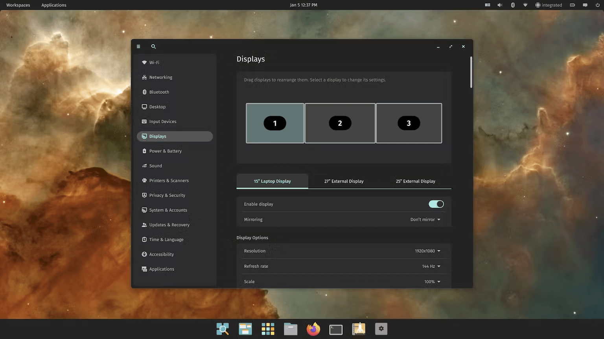
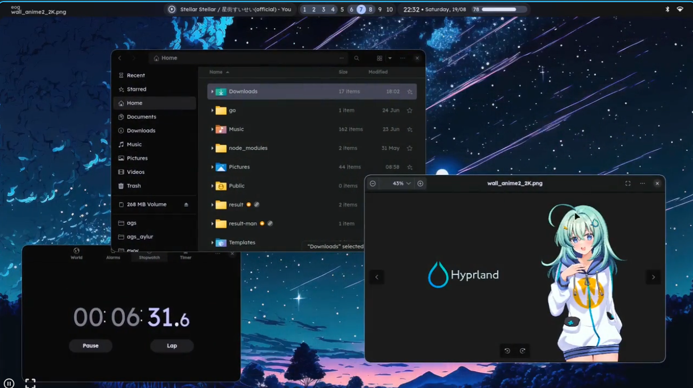

## <center>Arch Linux Installation Guide</center>

> Arch Linux Installation guide by `kurami` on 2025-05-15.


 
 Below is how I install Arch following the [Arch's installation guide](https://wiki.archlinux.org/title/Installation_guide) and the choices I do when installing a minimal Arch environment with:

- Encrypted root partiiton with BTRFS + subvolumes.
- Encrypted SWAP partition.
- Hibernation enabled thanks to SWAP.
- ZRAM enabled.
- Snapshots with snapper.
- Yay AUR Helper
- DE or WM of your choice! (Hyprland, KDE Plasma, Cosmic)

> If you want a quick guide with only the commands straight to the installation, you can visit my [Quick Install guide](https://github.com/Kurami32/) (Not available yet)

## 1. Pre-installation

### 1.1 Prepare USB Install Media

Go to [Arch Linux downloads page](https://archlinux.org/download/), select a mirror, and download the ISO file. `archlinux-RELEASE_VERSION-x86_64.iso`

Prepare a USB flash drive as an installer using one of these three methods:

**a) Method #1: Ventoy (Windows and Linux)** 

I use **Ventoy** to create a **multiboot installer**. Simply copy `archlinux-RELEASE_VERSION-x86_64.iso` to the USB drive, reboot, and the auto-generated menu lists all the disk images available to boot. [How to install Ventoy](https://www.ventoy.net/en/doc_start.html)

**b) Method #2: dd (Linux)** 

Write the installer to an **unmounted** USB drive using the `dd` command as root.

> **BE VERY CAREFUL TO NOTE THE PROPER DEVICE. ALL DATA ON THE DEVICE WILL BE OVERWRITTEN.**

*Example:* Under Linux, if a USB drive appears as `sdx1`, then write the installer to `sdx` (remove partition number) ...

```shell
sudo dd if=archlinux-RELEASE_VERSION-x86_64.iso of=/dev/sdx bs=4M status=progress oflag=sync
```

**c) Method #3: Rufus (Windows)** 

[Download Rufus](https://rufus.ie/en/). Open the `.exe` and select your USB drive, then select the  `archlinux-RELEASE_VERSION-x86_64.iso` and click start.

- In the "Boot selection" section, click the "Select" button and navigate to the location where was downloaded `archlinux-RELEASE_VERSION-x86_64.iso`

- Click the "Start" button to begin the creation of the bootable USB drive with our Arch ISO. Rufus will warn about all the data on the USB will be destroyed, confirm to proceed.

### 1.2. Booting on Our USB Installer
Insert USB installer containing our Arch ISO into target device and boot. Installer auto-logins as `root`. You can also see [This section](https://wiki.archlinux.org/title/Installation_guide#Boot_the_live_environment). of the official arch wiki.

### 1.3 Verify Boot Mode

If **UEFI mode** is enabled on a UEFI motherboard, the installer will boot Arch accordingly.
Verify system is booted via UEFI by listing contents of `efivars` 

```shell
ls /sys/firmware/efi/efivars
```

If the directory don't exist, the system is booted in **BIOS mode**.

> **Note:** Some of the instructions below - drive partitioning and GRUB setup in particular - will need to be modified if using BIOS mode. 

### 1.4 Keyboard and Font

> Default console keymap is `us`.

*Optional*: List available layouts ...

```shell
localectl list-keymaps
```

*Optional*: You can filter the layouts with grep (*example*: Filter `us`based keyboards) ...

```shell
localectl list-keymaps | grep us
```

I have a latinoamerican keyboard, so, in my case I should use ...

```shell
loadkeys la-latin1
```

*Optional*: Default font in the installer is very small on high resolution displays. Alternative fonts are available in `/usr/share/kbd/consolefonts`. You can list them with:

```shell
ls /usr/share/kbd/consolefonts
```

Switch to a larger font size (example: *terminus* `ter-v24n`) ...

```shell
setfont ter-v24n
```
### 1.5 Connect to the Internet (if not Using ethernet)
Connect to WiFi using `iwctl` utility ...

```shell
iwctl # Start iwctl utility
station wlan0 get-networks # Get SSID of nearby WiFi Networks
station wlan0 connect <Name of WiFi access point> # Connect to your WiFI
exit # Exit from iwctl utility
```

Check your internet connection ...

```shell
ping -c4 archlinux.org 
```

### [OPTIONAL] SSH to Another Machine (remote installation)

Create a password for the live environment ...
> Don't worry here, you can use a weak password because this will be only used for ssh the live enviroment.

```shell
passwd root
```

Start SSH service and check your local IP address of your computer ...

```shell
systemctl start sshd.service #Start SSH service
ip addr show # Search for something like '192.168.x.x'
```

Then, on the other machine ...

```shell
ssh root@192.168.x.x # Replace 192.168.x.x with your local IP address.
```

Enter you previously created password and that's all, you can do the installation remotely.

### 1.6. Update System Clock
```shell
timedatectl set-ntp true # For sync the time
timedatectl status # Check if the system time is correct.
```

### 1.7. Partition the Disks
Identify the internal storage device where Arch Linux will be installed by running `lsblk`, the output will be something like this:

```shell
root@archiso ~ # lsblk
NAME        MAJ:MIN RM   SIZE RO TYPE MOUNTPOINTS
loop0         7:0    0 942.7M  1 loop /run/archiso/airootfs
sda           8:0    1  28.9G  0 disk 
├─sda1        8:1    1  28.8G  0 part 
│ └─ventoy  253:0    0   1.3G  1 dm   
└─sda2        8:2    1    32M  0 part 
nvme0n1     259:0    0 953.9G  0 disk 
├─nvme0n1p1 259:1    0     1G  0 part 
├─nvme0n1p2 259:2    0     2G  0 part 
└─nvme0n1p3 259:3    0 950.9G  0 part 
```

> External disks are mostly `sdb`, but in my case the live USB formatted with ventoy containing the Arch ISO is `sda`. **BE CAREFUL**, you may have other drives too where you store other data, don't select the wrong drive because will be wiped, and **ALL** the data there will be lost.

### 1.8. Delete Old Partition Tables

*Example:* In my case my target disk for the installation is identified as `nvme0n1` where we'll install Arch Linux. Replace it with your target disk.

```shell
wipefs -af /dev/nvme0n1
sgdisk --zap-all --clear /dev/nvme0n1
partprobe /dev/nvme0n1
```

### 1.9. Partition the Disk

We will use `gdisk` for this purpose. 
> ***Note***: We will have two partitions [BOOT] and [ROOT], the encrypted partiton will be [ROOT], and [BOOT] unenencrypted for the bootloader (GRUB) could access to it.

```shell
root@archiso ~ # gdisk /dev/nvme0n1p1

GPT fdisk (gdisk) version 1.0.10

Partition table scan:
  MBR: protective
  BSD: not present
  APM: not present
  GPT: present

Found valid GPT with protective MBR; using GPT.

                     _[create partition 1: BOOT]_

Command (? for help): n
Partition number (1-128, default 1): Enter ↵
First sector (34-2000409230, default = 2048) or {+-}size{KMGTP}: Enter ↵
Last sector (2048-2000409230, default = 2000408575) or {+-}size{KMGTP}: 1G
Current type is 8300 (Linux filesystem)
Hex code or GUID (L to show codes, Enter = 8300): ef00
Changed type of partition to 'EFI system partition'
					                      
                     _[create partition 4: ROOT]_
                     
Command (? for help): n    
Partition number (4-128, default 4): Enter ↵
First sector (34-976773134, default = 9439232) or {+-}size{KMGTP}: Enter ↵
Last sector (9439232-976773134, default = 976773119) or {+-}size{KMGTP}: Enter ↵
Current type is 8300 (Linux filesystem)
Hex code or GUID (L to show codes, Enter = 8300): 8300
Changed type of partition to 'Linux filesystem'
                          
						   _[Write the changes]_
						   
Command (? for help): w

Final checks complete. About to write GPT data. THIS WILL OVERWRITE EXISTING
PARTITIONS!!

Do you want to proceed? (Y/N): Y
OK; writing new GUID partition table (GPT) to /dev/nvme0n1.
The operation has completed successfully.
```

### 1.10. Format Partitions

Use `lsblk` again for see the partitions that we've created ...

```shell
root@archiso ~ # lsblk
NAME        MAJ:MIN RM   SIZE RO TYPE MOUNTPOINTS
loop0         7:0    0 942.7M  1 loop /run/archiso/airootfs
sda           8:0    1  28.9G  0 disk 
├─sda1        8:1    1  28.8G  0 part 
│ └─ventoy  253:0    0   1.3G  1 dm   
└─sda2        8:2    1    32M  0 part 
nvme0n1     259:0    0 953.9G  0 disk 
├─nvme0n1p1 259:3    0  1023M  0 part 
└─nvme0n1p2 259:4    0 952.9G  0 part 
```

Format the [BOOT] partition ...

```shell
mkfs.fat -F32 /dev/nvme0n1p1
```

### 1.11. Encrypting the [ROOT] Partition

Format the [ROOT] partition with LUKS encryption ...

```shell
cryptsetup luksFormat --type luks2 /dev/nvme0n1p2
# You will now be prompted for a password...
```

Open the encrypted  [ROOT] partition ...

> You can change the label `cryptroot` with whatever you want, but make sure that you'll replace all the commands containing that label with your desired name.

```shell
cryptsetup luksOpen /dev/nvme0n1p2 cryptroot
# You will need to enter the password that you typed before
```

Format and mount the [ROOT] partition ...

```shell
mkfs.btrfs -f /dev/mapper/cryptroot
mount /dev/mapper/cryptroot /mnt
```

#### Create Btrfs Subvolumes for [ROOT]

We will create additional subvolumes for more control over rolling back the system to a previous state, while preserving the current state of other directories. These subvolumes will be excluded from any root subvolume snapshots:

**Subvolume** -- **Mountpoint**

- `@` -- `/` (root directory)
- `@cache` -- `/var/cache`
- `@home` -- `/home` (preserve user data)
- `@snapshots` -- `/.snapshots` (is where the snapshots will be stored)
- `@log` -- `/var/log` (excluding log files makes troubleshooting easier after reverting `/`)
- `@var_tmp` -- `/var/tmp` (prevents transient files from bloating your snapshots over time)
- `@tmp` -- `/tmp` (prevents transient files from bloating your snapshots over time)
- `@images` -- `/var/lib/libvirt` (Virtual machine images QEMU KVM)
- `@docker` -- `/var/lib/docker` (Docker volumes)

For create them ...
```shell
btrfs su cr /mnt/@
btrfs su cr /mnt/@cache
btrfs su cr /mnt/@home
btrfs su cr /mnt/@snapshots
btrfs su cr /mnt/@logs
btrfs su cr /mnt/@var_tmp
btrfs su cr /mnt/@tmp
btrfs su cr /mnt/@images
btrfs su cr /mnt/@docker
umount /mnt
```

### 1.12. Mount the Partitions and Subvolumes

```shell
# Mount root
mount -o compress=zstd:1,noatime,subvol=@ /dev/mapper/cryptroot /mnt
# Create directories
mkdir -p /mnt/{boot/efi,home,.snapshots,tmp,var/{cache,log,tmp,lib/{libvirt,docker}}}
# Mount /var/cache
mount -o compress=zstd:1,noatime,subvol=@cache /dev/mapper/cryptroot /mnt/var/cache
# Mount /home
mount -o compress=zstd:1,noatime,subvol=@home /dev/mapper/cryptroot /mnt/home
# Mount ./snapshots
mount -o compress=zstd:1,noatime,subvol=@snapshots /dev/mapper/cryptroot /mnt/.snapshots
# Mount /var/log
mount -o compress=zstd:1,noatime,subvol=@logs /dev/mapper/cryptroot /mnt/var/log
# Mount /var/tmp
mount -o compress=zstd:1,noatime,subvol=@var_tmp /dev/mapper/cryptroot /mnt/var/tmp
# Mount /tmp
mount -o compress=zstd:1,noatime,subvol=@tmp /dev/mapper/cryptroot /mnt/tmp
# Mount /var/lib/libvirt
mount -o compress=zstd:1,noatime,subvol=@images /dev/mapper/cryptroot /mnt/var/lib/libvirt
# Mount /var/lib/docker
mount -o compress=zstd:1,noatime,subvol=@docker /dev/mapper/cryptroot /mnt/var/lib/docker
```

Mount [BOOT] partition ...

```shell
# Create directory for ESP
mkdir /mnt/boot
# Mount ESP partition
mount /dev/nvme0n1p1 /mnt/boot
```

Verify if all the driver are correctly mounted ...

```shell
root@archiso ~ # lsblk
NAME          MAJ:MIN RM   SIZE RO TYPE  MOUNTPOINTS
loop0           7:0    0 942.7M  1 loop  
sda             8:0    1  28.9G  0 disk  
├─sda1          8:1    1  28.8G  0 part  
│ └─ventoy    253:0    0   1.3G  1 dm    
└─sda2          8:2    1    32M  0 part  
nvme0n1       259:0    0 953.9G  0 disk  
├─nvme0n1p1   259:3    0  1023M  0 part  /mnt/boot
└─nvme0n1p2   259:4    0 952.9G  0 part  
  └─cryptroot 253:1    0 952.9G  0 crypt /mnt/var/lib/docker
                                         /mnt/var/lib/libvirt
                                         /mnt/tmp
                                         /mnt/var/tmp
                                         /mnt/var/log
                                         /mnt/.snapshots
                                         /mnt/home
                                         /mnt/var/cache
                                         /mnt
```

### 1.13. Install Base System
Select an appropriate [microcode](https://wiki.archlinux.org/title/Microcode) package to load updates and security fixes from processor vendors.

View `cpuinfo` ...

```shell
grep vendor_id /proc/cpuinfo
```

Depending on the processor, set `microcode` for Intel ...

```shell
export microcode="intel-ucode"
```

Or for AMD ...

```bash
export microcode="amd-ucode"
```

Then, Install the base system ...

```shell
pacstrap -K /mnt base base-devel linux linux-firmware linux-headers ${microcode} btrfs-progs efibootmgr lvm2 cryptsetup neovim openssh reflector ${microcode} man-db mlocate networkmanager pacman-contrib sudo pkgfile micro zsh grub grub-btrfs kbd git wget
```

### 1.14. Generate Fstab

```shell
genfstab -U /mnt >> /mnt/etc/fstab
cat /mnt/etc/fstab
```

## 2. Configuring the System

We need to chroot on to the system ...

```shell
arch-chroot /mnt
```

### 2.1. Encrypting the SWAP Partition + Auto-unlock

 Format the SWAP Partition with LUKS:

```shell
cryptsetup luksFormat --type luks2 /dev/nvme0n1p2
```

Create the directory for store the key
```shell
mkdir -p /etc/keys
```

Generate the key ...

```
dd if=/dev/random of=/etc/keys/swap.key bs=1 count=4096 status=progress
```

Restrict permissions ...

```shell
chmod 600 /etc/keys/swap.key
```

Adding the key to the SWAP partition ...

```shell
cryptsetup luksAddKey /dev/nvme0n1p2 /etc/keys/swap.key
```

Open the encrypted SWAP partition with the added key:

```shell
cryptsetup open --key-file=/etc/keys/swap.key /dev/sda3 cryptswap
```

Format the encrypted partition:

```shell
mkswap -L cryptswap /dev/mapper/cryptswap
```

 Add this line to `/etc/crypttab` to ensure SWAP is decrypted at boot ...
 
> Just use `swap` parameter, LUKS2 automatically uses optimal parameters.

```shell
$ micro /etc/crypttab
# Line to add
cryptswap /dev/sda3 /etc/keys/swap.key swap
```

 Edit `/etc/fstab` and add the encrypted SWAP partition to be mounted automatically after unlock.

```shell
/dev/mapper/cryptswap swap defaults 0 0
```

Turn on SWAP

```shell
swapon /dev/mapper/cryptswap
```

### 2.2. Set Timezone

Set desired timezone (example: my timezone is `America/Lima`) and update the system clock ...

```bash
ln -sf /usr/share/zoneinfo/America/Lima /etc/localtime
hwclock --systohc
```

Verify if the hour and date is displayed correctly, if not, you selected a wrong timezone ...

```shell
date
```

### 2.3. Update Mirrors

Generate a new mirror selection using [reflector](https://wiki.archlinux.org/index.php/reflector).

*Example:* Verbosely select the 12 most recently synchronized HTTPS mirrors, sort them by download speed, and overwrite `mirrorlist` ...

```shell
sudo reflector --latest 12 --protocol https --sort rate --save /etc/pacman.d/mirrorlist --verbose
```

Then do ...

```shell
pacman -Syy
```

### 2.4. Installing Yay AUR Helper and Enabling Multilib Repository

Run the following commands for install `yay` ...

```shell
cd ~
git clone https://aur.archlinux.org/yay.git`
cd yay
makepkg -si
```    
	
Enable multilib repository on pacman ...

```shell
sudo micro /etc/pacman.conf
```
    
Uncomment the following lines by removing the # -character at the start them ...

```shell
[multilib]
Include = /etc/pacman.d/mirrorlist
```
    
Save the file with *CTRL+S* and close micro with *CTRL+Q*

### 2.5. Installing Packages

The majority of this packages are required for have a full-working system. (*example*: `networkmanager` which is required for have internet connection or `pipewire` for audio)

```shell
pacman --noconfirm -S xdg-desktop-portal-wlr networkmanager network-manager-applet dialog wpa_supplicant mtools dosfstools avahi xdg-user-dirs xdg-utils gvfs nfs-utils inetutils dnsutils alsa-utils pipewire pipewire-alsa pipewire-pulse pipewire-jack openssh rsync acpi acpi_call ipset sof-firmware nss-mdns acpid ntfs-3g xclip brightnessctl pacman-contrib mesa man-db man-pages ttf-firacode-nerd
```

This packages are optional, like bluez (Bluetooth), cups (for printers), extra fonts, and some utilities like decompression of `zip` files ...

```shell
pacman --noconfirm -S bluez bluez-utils cups cups-pdf exa bat duf btop zip unzip fastfetch ttf-firacode-nerd
```

> Install a Desktop Environment or Windows Manager of your choice:

[KDE PLASMA](https://kde.org/plasma-desktop/) (D.E.)...

```shell
pacman --noconfirm -S sddm plasma-desktop plasma-meta
```



[COSMIC](https://system76.com/cosmic/) (D.E.)...

```shell
pacman -S --noconfirm -S sddm cosmic
```



[HYPRLAND](https://hyprland.org/) (W.M.)...

```shell
pacman -S --noconfirm -S sddm hyprland
```




### 2.6. Install GPU Drivers

For install the GPU drivers of Intel & AMD GPUs you can just do ... 

```shell
pacman --noconfirm -S mesa
```

But for NVIDIA is a bit more tricky, you can follow this guide [How install  NVIDIA Drivers on Arch Linux](https://github.com/korvahannu/arch-nvidia-drivers-installation-guide) but I recommend follow it after we finish the installation of Arch, because we don't installed GRUB yet.

### 2.7. Set Locales

Set locale (*example*: my local is`en_US.UTF-8`) ...

```shell
echo "en_US.UTF-8 UTF-8" >> /etc/locale.gen
locale-gen
echo "LANG=en_US.UTF-8" >> /etc/locale.conf
```

### 2.8. Set Keyboard Layout

List available layouts ...

```shell
localectl list-keymaps
```

*Optional*: You can filter the layouts with grep (*example*: for filter `us`based keyboards) ...

```shell
localectl list-keymaps | grep us
```

I have a latinoamerican-based keyboard, so, in my case I should use `la-latin1`...

```shell
echo "KEYMAP=la-latin1" >> /etc/vconsole.conf
```

### 2.9. Set Editor

Set a system-wide default editor (*example*: `micro`) ...

```shell
echo "EDITOR=micro" > /etc/environment && echo "VISUAL=micro" >> /etc/environment
```

### 2.10. Set Hostname and Localhost

```shell
echo "arch" >> /etc/hostname
echo "127.0.0.1 localhost" >> /etc/hosts
echo "::1       localhost" >> /etc/hosts
echo "127.0.1.1 arch.localdomain arch" >> /etc/hosts
```

### 2.11. Set Root Password

```shell
passwd root
```

### 2.12. Add Users

Replace [USERNAME] with your desired name ...

```shell
useradd -m -G wheel [USERNAME]
passwd [USERNAME]
```

 Add the users to group wheel, uncomment`#%wheel ALL=(ALL:ALL) ALL` ...

```shell 
EDITOR=micro sudo -E visudo
usermod -aG wheel [USERNAME]
```

### 2.13 Edit Initcpio Modules for Btrfs, Encryption and Hibernation

Set necessary  `MODULES` ,`BINARIES` and `HOOKS` in `/etc/mkinitcpio.conf`:

```shell
micro /etc/mkinitcpio.conf
```

On the line `MODULES` and `BINARIES`:

```shell
MODULES=(usbhid atkbd)
BINARIES=(btrfs setfont)
```

On the line `HOOKS`:

```shell
HOOKS=(base udev autodetect microcode modconf kms keyboard keymap consolefont block encrypt lvm2 resume filesystems fsck)
```

Recreate the initramfs image ...

```shell
mkinitcpio -P
```

### 2.14. Configuring and Installing GRUB

> We will configure GRUB for point to the encrypted disk and enable hibernation.

Determine the UUID of the [ROOT] encrypted partition ...

```shell
# UUID FROM ENCRYPTED DISK
blkid /dev/nvme0n1p2 -o value -s UUID
```

Edit the line `GRUB_CMDLINE_LINUX_DEFAULT` on `/etc/default/grub`:

```shell
GRUB_CMDLINE_LINUX_DEFAULT="loglevel=3 quiet cryptdevice=UUID=UUID-OF-ENCRYPTED-PARTITION:cryptroot root=/dev/mapper/cryptroot resume=/dev/mapper/cryptswap"
```

*Example:* If the UUID of the encrypted partition was `180901b5-151a-45e3-ba87-28f02b124666`, then ...

```shell
GRUB_CMDLINE_LINUX_DEFAULT="loglevel=3 quiet cryptdevice=UUID=180901b5-151a-45e3-ba87-28f02b124666:cryptroot root=/dev/mapper/cryptroot resume=/dev/mapper/cryptswap"
```

Uncomment the line `GRUB_ENABLE_CRYPTODISK`:

```shell
GRUB_ENABLE_CRYPTODISK=y
```

Edit the line `GRUB_PREOLOAD_MODULES`:

```shell
GRUB_PRELOAD_MODULES="part_gpt part_msdos cryptodisk luks2"
```

Save the file with CTRL + S and then run this command for install GRUB on the ESP (EFI) partition ...

```shell
grub-install --target=x86_64-efi --efi-directory=/boot/efi --bootloader-id=GRUB
```

Generate the GRUB config file ...

```shell
grub-mkconfig -o /boot/grub/grub.cfg
```

### 2.15. Enable Services
```shell
systemctl enable NetworkManager
systemctl enable bluetooth # Optional
systemctl enable cups.service # Optional
systemctl enable sshd # Optional
systemctl enable avahi-daemon
systemctl enable reflector.timer
systemctl enable fstrim.timer
systemctl enable acpid
```

> Now that we installed GRUB, don't forget to install the NVIDIA GPU drivers if you have one, you can do it following this guide: [How install  NVIDIA Drivers on Arch Linux](https://github.com/korvahannu/arch-nvidia-drivers-installation-guide) 

### 2.16. Setup ZRAM

Install `zram-generator`

```shell
pacman -S zram-generator
```

Create or edit the configuration file `/etc/systemd/zram-generator.conf` and add ...

```shell
[zram0]
# Use 2x RAM size caping to 6GB (adjust multiplier as needed)
zram-size = min(ram * 2, 6144)
compression-algorithm = zstd
swap-priority = 100
```

Apply the configuration ...

```shell
sudo systemctl daemon-reload
sudo systemctl start /dev/zram0
```

Verify ZRAM is Active

```shell
swapon --show
# OR
cat /proc/swaps
```

### 2.17. Rebooting to Our Installing System

We can finally reboot and unplug the USB installer and start working with our system directly ... 

```shell
umount -a
exit
reboot
```

We will be prompted for our password of the encrypted disk, enter that password, wait for start, and then we will be able to use our system! 

## <center>Post-Installation</center>

### Snapshots With Snapper

#### 1. Install Snapper and Snap-pac

Install the `snapper` and `snap-pac` package for be able to do snapshots automatically ...

```shell
$ sudo pacman -S snapper snap-pac
```

##### 2. Create Snapshot Configuration for the Root Subvolume

 Snapper's `create-config` command assumes:

- Subvolume `@` already exists and is mounted at `/`.
- `/.snapshots` directory is *not* mounted and doesn't exist.

During the Arch install, we created the `@` and `@snapshots` subvolumes, and `/.snapshots` mountpoint. Before letting Snapper do its config, so, we need to move the earlier snapshot setup.

Unmount the subvolume and remove the mountpoint ...

```shell
$ sudo umount /.snapshots
$ sudo rm -rf /.snapshots
```

Create a new `root` config ...

```shell
$ sudo snapper -c root create-config /
```

This generates:

- Configuration file at `/etc/snapper/configs/root`.
- Add `root` to `SNAPPER_CONFIGS` in `/etc/conf.d/snapper`.
- Subvolume `.snapshots` where future snapshots for this configuration will be stored.

#### 3. Setup /.snapshots

List subvolumes ...

```shell
$ sudo btrfs subvolume list /
ID 256 gen 232 top level 5 path @
ID 257 gen 230 top level 5 path @cache
ID 258 gen 226 top level 5 path @home
ID 259 gen 9 top level 5 path @snapshots
ID 260 gen 232 top level 5 path @log
ID 261 gen 16 top level 256 path var/lib/portables
ID 262 gen 16 top level 256 path var/lib/machines
ID 263 gen 232 top level 256 path .snapshots
```

Note the `@snapshots` subvolume we created before, and the `.snapshots` created by Snapper.

We will delete the Snapper-generated subvolume, letting alone our `@snapshots` ...

```shell
$ sudo btrfs subvolume delete /.snapshots
Delete subvolume (no-commit): '//.snapshots'
```

Re-create and re-mount `/.snapshots` mountpoint ...

```shell
$ sudo mkdir /.snapshots
$ sudo mount -a
```

Set permissions. Owner must be `root`, and we need allow members of `wheel` (our user) to browse through snapshots ...

```shell
$ sudo chmod 750 /.snapshots
$ sudo chown :wheel /.snapshots
```

#### 4. Manual Snapshot

Example of taking a manual snapshot our install ...

```shell
$ sudo snapper -c root create -d "Arch encrypted!"
```

#### 5. Automatic Timeline Snapshots

Setup timed auto-snapshots by modifying `/etc/snapper/configs/root`.

Allow user (example: `kurami`) to work with snapshots ...

```shell
$ micro /etc/snapper/configs/root
ALLOW_USERS="kurami"
```

Example: For of some auto-cleanup snapshots limits ...

```shell
TIMELINE_MIN_AGE="3600"
TIMELINE_LIMIT_HOURLY="10"
TIMELINE_LIMIT_DAILY="10"
TIMELINE_LIMIT_WEEKLY="0"
TIMELINE_LIMIT_MONTHLY="10"
TIMELINE_LIMIT_QUARTERLY="0"
TIMELINE_LIMIT_YEARLY="0"
```

Start and enable `snapper-timeline.timer` to launch the automatic snapshot timeline, and `snapper-cleanup.timer` to periodically clean up older snapshots...

```shell
$ sudo systemctl enable --now snapper-timeline.timer
$ sudo systemctl enable --now snapper-cleanup.timer
```

#### 6. Pacman Auto-snapshots

Pacman `pre-` and `post-` snapshots are triggered before and after we install / update a package on our system.

Example: I install `fastfetch`, which triggers a `pre` and `post` install snapshot.

List configs ...

```bash
$ snapper list-configs
Config | Subvolume
-------+----------
root   | /
```

List snapshots taken for `root` ...

```bash
$ snapper -c root list
 # | Type   | Pre # | Date                        | User | Cleanup  | Description             | Userdata
---+--------+-------+-----------------------------+------+----------+-------------------------+---------
0  | single |       |                             | root |          | current                 |         
1  | single |       | Wed 14 Aug 2025 08:17:17 PM | root |          | Arch encrypted!         |         
2  | pre    |       | Wed 14 Aug 2025 08:18:02 PM | root | number   | pacman -S fastfetch     |         
3  | post   |     2 | Wed 14 Aug 2022 08:18:03 PM | root | number   | fastfetch               |
```

List updated subvolumes list, which now includes the snapshots ...

```shell
$ sudo btrfs subvolume list /
ID 256 gen 253 top level 5 path @
ID 257 gen 252 top level 5 path @cache
ID 258 gen 226 top level 5 path @home
ID 259 gen 253 top level 5 path @snapshots
ID 260 gen 256 top level 5 path @log
ID 261 gen 16 top level 256 path var/lib/portables
ID 262 gen 16 top level 256 path var/lib/machines
ID 264 gen 238 top level 259 path @snapshots/1/snapshot
ID 265 gen 251 top level 259 path @snapshots/2/snapshot
ID 266 gen 252 top level 259 path @snapshots/3/snapshot
```

#### 7. Updatedb

If `locate` is installed, skip indexing `.snapshots` directory by adding to `/etc/updatedb.conf` ...

```bash
PRUNENAMES = ".snapshots"
```

#### 8. Grub-btrfs

On the installation we did before, we installed GRUB-BTRFS alongside GRUB, which will include the snapshots as boot options in the `GRUB` boot loader menu.

Set the location of the directory containing the `grub.cfg` file in `/etc/default/grub-btrfs/config`.

Our `grub.cfg` (if you followed the install guide) is located in `/boot/grub`  ...

```shell
$ micro /etc/default/grub-btrfs/config
# Search for the line and uncomment it
GRUB_BTRFS_GRUB_DIRNAME="/boot/grub"
```

#### 9. Auto-update GRUB

Enable `grub-btrfsd.service` to auto-regenerate `grub-btrfs.cfg` whenever a modification appears in `/.snapshots` ...

```shell
$ sudo systemctl enable --now grub-btrfsd.service
$ sudo grub-mkconfig -o /boot/grub/grub.cfg
```

At the next boot, we will have an submenu in `GRUB` for our Arch Linux snapshots.

#### 10. Read-only Snapshots and Overlayfs

Booting on a snapshot is done in *read-only* mode.

[This can be tricky:](https://github.com/Antynea/grub-btrfs/blob/master/initramfs/readme.md)

> Using overlayfs, the booted snapshot will behave like a live-cd in non-persistent mode. The snapshot will not be modified, the system will be able to boot correctly, because a writeable folder will be included in the RAM ... Any changes in this system thus started will be lost when the system is rebooted/shutdown.

Add the hook `grub-btrfs-overlayfs` at the end of `HOOKS` in `/etc/mkinitcpio.conf` ...

```shell
HOOKS=(base udev ... fsck grub-btrfs-overlayfs)
```

Re-generate initramfs ...

```shell
$ sudo mkinitcpio -P
```

Note: Any snapshots that do not include this modified initramfs will not be able to use overlayfs. (like the example snapshot of earlier).

#### 11. System Rollback

Snapper includes a rollback tool, but on Arch systems the preferred method is a manual rollback.

After booting into a snapshot mounted using overlayfs, we need to mount the toplevel subvolume. That is, omit any subvolid or subvol mount flags (*example:* an encrypted device map labelled `cryptdev`) ...

```shell
$ sudo mount /dev/mapper/cryptdev /mnt
```

Move the broken `@` subvolume out of the way ...

```shell
$ sudo mv /mnt/@ /mnt/@.broken
```

Or simply delete the subvolume ...

```shell
$ sudo btrfs subvolume delete /mnt/@
```

Find the number of the snapshot that you want to recover ...

```shell
$ sudo grep -r '<date>' /mnt/@snapshots/*/info.xml
[...]
/.snapshots/8/info.xml:  <date>2022-08-20 15:21:53</date>
/.snapshots/9/info.xml:  <date>2022-08-20 15:22:39</date>
```

Create a read-write snapshot of the read-only snapshot taken by Snapper ...

```shell
$ sudo btrfs subvolume snapshot /mnt/@snapshots/number/snapshot /mnt/@
```

Where `number` is the snapshot you wish to restore as the new `@`.

Unmount `/mnt`.

`reboot` via terminal or by GUI.
